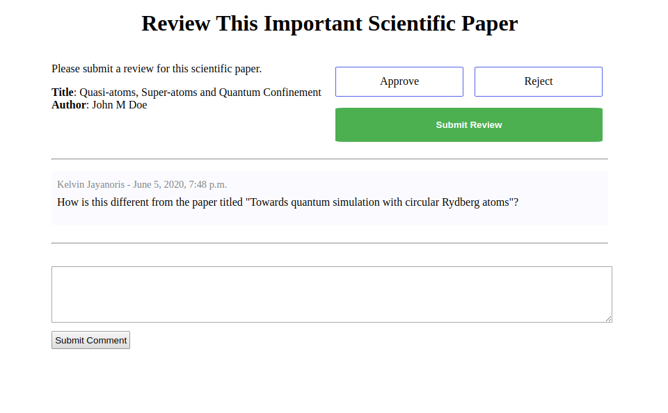

# django-model-reviews

Easy moderation of changes made to models.



## What is this for

This is a reusable library (django app) that can be used and re-used to implement reviews/moderation for Django models that need it.

Therefore, things start with a model that needs the ability to be reviewed or moderated.  Once this model is set up to work with `django-model-reviews`, every time an object is created or updated a request for review/moderation will be created.

When the model objects that need to be reviewed/moderated are created, a few things happen:

1. A ModelReview object is created and linked to the object that needs moderation
2. One or more Reviewer objects are created.  Reviewers are the users who are allowed to do the actual review/moderation.  This is determined by the `set_reviewers_function` option (see below).
3. An email is sent to each reviewer, asking them to do the review.

The next step would be that one of the reviewers logs in, and does the actual moderation/review.  This library includes a Django view and form than enables this.

When this is done, an email is sent nn email is sent to the user who requested the review.  This user is determined by using the `set_user_function` option (see below).

Finally, any side effects arising from the review are propagated.  Side effects are configurable via the `side_effect_function` option (see below).

And with that, the review process is completed.

## Installation

1. Install the app: `pip install django-model-reviews`
2. Add `model_reviews` to `INSTALLED_APPS`.

   Each model review can optionally have comments.  To enable this, also add `django_comments` to installed apps.  Make sure to add `django_comments` **after** `model_reviews`.

   ```py
   INSTALLED_APPS = [
       # the usual django stuff
       'model_reviews',
       'django_comments',
   ]
   ```

3. Run `manage.py migrate` so that Django will create the model_review tables.
4. Add the model_reviews app’s URLs to your project’s urls.py:

    ```py
    urlpatterns = [
       # ...
       path("reviews/", include('model_reviews.urls')),
       # ...
   ]
    ```

5. Optionally, also install [django_comments](https://github.com/django/django-contrib-comments)

## How to use

### Set up models

Each model that needs a review step will need to be set up by extending `AbstractReview`.

This will result in the model having two new fields:

- **review_reason**: a text field that a user can fill in when requesting a review
- **review_status**: can be one of Pending, Approved or Rejected (defaults to Pending)
- **review_date**: the date that the review was done (defaults to None)

When creating you model class, you can set further options like so:

- **monitored_fields**: a list of fields that should trigger a review.  That is, if these fields change a review will be needed
- **side_effect_function**: path to function that will be run after successful review
- **set_reviewers_function**: path to function that will be used to determine reviewers
- **set_user_function**: path to function that will be used to determine the user for a review object
- **request_for_review_function**: path to function that will be used to send email to reviewers
- **review_complete_notify_function**: path to function that will be used to send email to user after review

You can also set email options as such:

- **review_request_email_subject**: email subject to request a review.  Default is `There has been a new request that needs your attention.`
- **review_request_email_body**: email body to request a review.  Default is `New Request For Approval`
- **review_complete_email_subject**: subject of email sent after review is complete.  Default is `Your request has been processed`
- **review_complete_email_body**: body of email sent after review is complete.  Default is `Your request has been processed, please log in to view the status.`
- **email_template**: email template to use.  Default is `generic`
- **email_template_path**: path to email template to use.  Default is `model_reviews/email`

Below is an example model class definition:

```python
from django.contrib.auth.models import User
from django.db import models

from model_reviews.models import AbstractReview

class ResearchPaper(AbstractReview):
    """
    Model definition for important scientific research papers.

    In this example this is a model which needs to be reviewed.
    """

    name = models.CharField(max_length=100)
    # ... other important fields would go here

    # this can be used as the user who is "requesting a view"
    user = models.ForeignKey(
        User, on_delete=models.CASCADE, null=True, default=None, blank=True
    )

    # options
    # List of fields that need moderation/review
    monitored_fields: List[str] = ["review_status", "review_date", "name"]
    # path to function that will be run after successful review
    side_effect_function: Optional[str] = "your_app.some_path.side_effect_function"
    # path to function that will be used to determine reviewers
    set_reviewers_function: Optional[str] = "your_app.some_path.set_reviewers_function"
    # path to function that will be used to determine the user for a review object
    set_user_function: Optional[str] = "model_reviews.side_effects.set_review_user"
    # path to function that will be used to send email to reviewers
    request_for_review_function: Optional[
        str
    ] = "model_reviews.emails.send_single_request_for_review"
    # path to function that will be used to send email to user after review
    review_complete_notify_function: Optional[
        str
    ] = "model_reviews.emails.send_review_complete_notice"
```

### Set up templates

For best results, you would want to [override](https://docs.djangoproject.com/en/dev/howto/overriding-templates/) the `model_reviews/modelreview_detail.html` (you can view our [starter template in the templates directory](model_reviews/templates/model_reviews/modelreview_detail.html))   template in your own Django app.

You should modify this template to look exactly as you wish, and include all the information needed for a user to perform a review.  The template receives a context variables named `object` which is the ModelReview instance in question.  `object.content_object` in turn refers to the instance of the model being reviewed.

### Set up emails

You likely will want to heavily customize the emails being sent.  The best way to do this is to change the templates being used to send emails.  The default templates used are in this directory `model_reviews/templates/model_reviews/email`.  To change this, do the following:

1. Copy the templates in the email directory to a directory of your choice
2. Modify the `email_template` and `email_template_path` options on your model class to point to the new templates from step just 1 above.
3. Modify your custom email templates to your heart's content.
4. You can also optionally change the `request_for_review_function` and `review_complete_notify_function` to modify the emails further.  This functions simply specify what is included in the emails sent, and you can provide your own functions to configure this.  The default functions are here: [model_reviews/emails.py](model_reviews/emails.py)

### Set up comments

You can optionally set up django_comments (formerly of django.contrib fame) to add comment functionality in your reviews.  Please see the [django_comments documentation](https://github.com/django/django-contrib-comments) for further guidance on how to install this library.

The starter template over at `model_reviews/modelreview_detail.html` includes commented out code that would add our own starter django_comments integration which live at `model_reviews/templates/comments`.

## Contribution

- Clone this repo
- Run: `pip install -r requirements/dev.txt`
- Run: `pre-commit install`

## Tests

- Clone this repo
- Run: `pip install -r requirements/dev.txt`
- Run: `tox`

## Inspiration

[django-approval](https://github.com/artscoop/django-approval)
